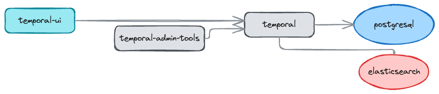
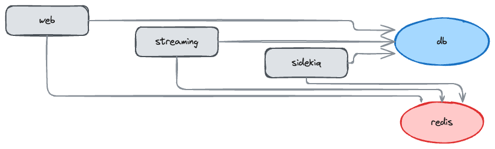

# Clarity

Generate Excalidraw architecture diagrams from Infrastructure-as-Code files.

Clarity parses Docker Compose and Helm charts, uses LLM enhancement to add metadata, and renders hand-drawn style architecture diagrams with automatic layout.

## Examples

### Temporal



### Mastodon



## Features

- **Multi-format parsing** - Supports Docker Compose and Helm charts
  - Docker Compose: services, dependencies, volumes, ports
  - Helm: values.yaml inference, Chart.yaml dependencies, rendered manifest analysis
- **LLM enhancement** - Adds service descriptions and logical groupings via OpenRouter API
- **Semantic layout** - ELK.js positions services in layers (ui → api → worker → data → infrastructure)
- **Excalidraw output** - Hand-drawn style with distinct shapes per service type:
  - Rectangles for application services
  - Ellipses for databases and caches
  - Diamonds for message queues
  - Color coding by category (blue=database, red=cache, green=storage, yellow=queue)
- **PNG rendering** - Headless Puppeteer export for sharing

## Installation

```bash
bun install
```

## Quick Start

```bash
# Fetch a project's IaC files (Docker Compose or Helm)
bun run clarity fetch myproject --repo https://github.com/org/repo

# For Helm charts, specify the chart path
bun run clarity fetch myproject --repo https://github.com/org/repo --helm charts/myapp

# Generate diagram
bun run clarity run myproject

# View the output
open test-data/myproject/runs/*/diagram.png
```

## Configuration

Set your OpenRouter API key for LLM enhancement:

```bash
# Via CLI (stored in ~/.config/clarity/config.json)
bun run clarity config set-key <your-openrouter-api-key>

# Or via environment variable
export OPENROUTER_API_KEY=<your-key>
```

Without an API key, diagrams are generated with basic parsing only (no service categorization or grouping).

## CLI Commands

```bash
clarity fetch <project> --repo <url>   # Download IaC files from a repo
clarity list                            # List configured projects
clarity run <project>                   # Run full pipeline
clarity run <project> --step parse      # Run single step
clarity inspect <project> --run <id>    # View previous run details
clarity config show                     # Show current configuration
clarity config set-key <key>            # Set OpenRouter API key
```

## Pipeline

1. **Parse** - Convert IaC files (Docker Compose or Helm) to intermediate graph
2. **Enhance** - LLM adds service descriptions and group metadata
3. **Layout** - ELK.js computes node positions with semantic layering
4. **Generate** - Create Excalidraw JSON and render PNG

Outputs saved to `test-data/<project>/runs/<timestamp>/`:

- `01-parsed.json` - Raw parsed graph
- `02-enhanced.json` - Graph with LLM enhancements
- `03-elk-input.json` / `03-elk-output.json` - Layout data
- `diagram.excalidraw` - Excalidraw file (open in excalidraw.com)
- `diagram.png` - Rendered image

## Development

```bash
bun test                    # Run all tests
bun test --grep "enhance"   # Run tests matching pattern
bun run lint                # Check code style
bun run format              # Auto-format code
```

## Roadmap

- [x] Helm chart parsing
- [ ] Terraform parsing
- [ ] Ansible playbook parsing
- [ ] Multi-file compose merging
- [ ] Interactive diagram editing
